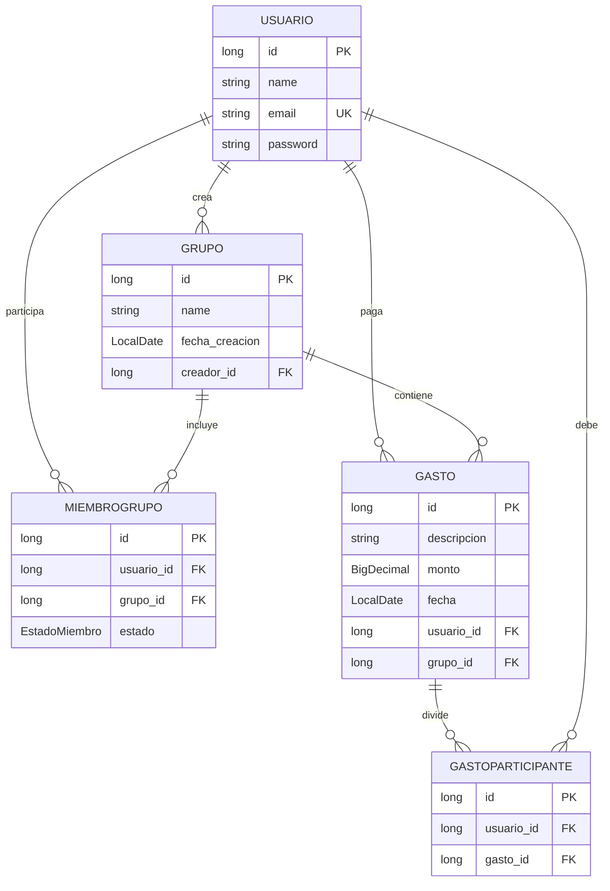

# Diagrama Entidad-Relación (DER)

## Diagrama

## Estados de la relación MIEMBROGRUPO

El atributo `estado` permite controlar la situación del usuario dentro del grupo:

* `PENDIENTE`: el usuario recibió una invitación, pero todavía no la ha aceptado.
* `MIEMBRO`: el usuario aceptó la invitación y pertenece al grupo.
* `RECHAZO`: el usuario rechazó la invitación.

Estos estados permiten manejar el flujo de invitaciones sin crear una entidad adicional.
